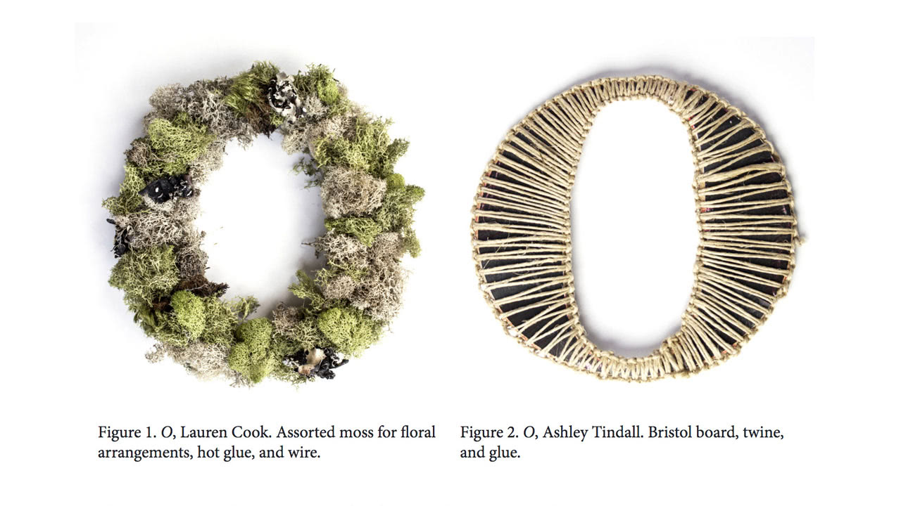

# Character & Description

> 90 percent of design is typography. And the other 90 percent is whitespace.
>
> —[Jeffrey Zeldman](https://twitter.com/zeldman/status/679727437198929921)


<cite>[Hilma af Klint](https://www.hilmaafklint.se/en/), Atom Series, 1919</cite> (via [coa.edu](https://www.coa.edu/live/profiles/1107-catherine-clinger/templates/details/faculty.php))

**Alt text description:** `A large painted black serif capital letter O with a white oval center, on an off-white background.`

> Alternative text should be succinct, yet descriptive of the content and function of an image. Lengthy alternative text (more than around 100 characters) often indicates that extraneous content or content that is not available to sighted users is being presented.
>
> [Perceivable](https://webaim.org/standards/wcag/checklist#perceivable) guideline via WebAIM’s WCAG 2 Checklist

## Brief

1. Design a bespoke character; working from the modern English alphabet, choose a single letterform from A to Z (one of 26 letters) using any style (lowercase or uppercase, sans-serif or serif, cursive or fantasy, etc.) and technique (analog or digital).
2. Write a concise, accessible, and semantic alternative text description of your final letterform artwork as a single sentence in under 100 characters.
    - For example: A large painted black serif capital letter O with a white oval center, on an off-white background.
3. Also consider text for a caption: Letter, designer, and a list of materials or process.
    - For example: *O*, Lauren Cook. Assorted moss for floral arrangements, hot glue, and wire.

### Details

#### Artwork

Capture and save final artwork in a digital format using these guidelines:

- Size: Use a square with a width and height of `1080 px` × `1080 px` (think Instagram artwork size).
- Format: If it’s a photo, save as a JPG; and if it’s *not* a photo, save as a PNG; or if it’s animation or video, save as an animated GIF but consider including an alternative still frame as well.
- Name: Use a meaningful filename, in all-lowercase, and separate words with hyphens. See [Naming guidelines](https://developers.google.com/style/filenames) and <cite>[Dashes vs. underscores](https://www.mattcutts.com/blog/dashes-vs-underscores/)</cite> for details.
  - Use the filename convention of case, letter, first name initial followed by last name (surname) combined with the best practice of all-lowercase and separate words with hyphens.
    - For examples: `uppercase-and-jgagne.png`

**Optional:**

- Collect and save sketches to document your process (as a case study).

#### Text

- Write your description as a single sentence in sentence case; start with a capital letter and end with a period.
- Keep your description short; aim for 100 characters or less, unless there is a lot to describe (120 is a good limit).

**Note:**

- Capitalize abbreviations and acronyms, but remove ampersands.
  - For example: The acronym (and brand) “C&A” becomes “C and A”.

### Handoff

We’ll discuss the work and handoff details in class. In the interim, share via email or Slack for *optional* feedback before class.

**Update:** Share your repo URL in the `01-character-description` channel of your Slack workspace.

#### GitHub

- Create a project folder (repo) with a markdown and image file.
  - For example:
    - `character-description`
      - `character-description.md`
      - `uppercase-and-jgagne.png`

#### Markdown

- `character-description.md`

```
## Character & Description


*&*, Justin Gagne. Screenshot of an artboard in Adobe Illustrator.

- - -

A close-up of a 16 point ampersand typed in Trebuchet MS viewed in Illustrator’s Pixel Preview mode.

```

**Optional:**

For those with additional artwork (sketches) and text (information), please collate and show that work using basic markdown to create subheading, lists, etc., as shown below.

```
## Character & Description


*&*, Justin Gagne. Screenshot of an artboard in Adobe Illustrator.

- - -

A close-up of a 16 point ampersand typed in Trebuchet MS viewed in Illustrator’s Pixel Preview mode.

### Process

#### Sketches


Caption for sketch 1.

#### Keywords

- ampersand
- pixel
- preview
```

#### Artwork

- Use the filename convention of case, letter, first name initial followed by last name (surname).
  - For examples: `uppercase-and-jgagne.png`

**Note:**

- Keep artwork and text as separate pieces of content.

## Examples



Analog student work from <cite>[Experimental A–Z, 0–9](https://educators.aiga.org/wp-content/uploads/2013/12/hester)</cite> taught by [Cassie Hester](https://experimentaltypography.com/) and [Joey Hannaford](http://www.joeyhannaford.com).

## Readings

### Alt Text

- [How to Write Effective Alt Text](https://www.3playmedia.com/2019/12/27/alt-text-marketing/)
- [How to Write Great Alt Text — And Why It Matters](https://aceseditors.org/news/2020/how-to-write-great-alt-text-and-why-it-matters)
- [alt attributes like paragraphs](https://daverupert.com/2020/09/alt-attributes-like-paragraphs/)
- [Alt text is part of your site’s content](https://www.centercentre.com/2016/06/30/2016-06-30-alt-text-is-part-of-your-sites-content/)
- [When writing alt text, ask yourself this question](https://www.centercentre.com/2016/06/09/2016-06-09-when-writing-alt-text-ask-yourself-this-question/)
- [Alt-texts: The Ultimate Guide](https://axesslab.com/alt-texts/)
- [Include descriptive titles, captions, filenames, and text for images](https://support.google.com/webmasters/answer/114016?hl=en#descriptive-titles-captions-filenames)
- [Rethinking Accessible Drop Caps: Pattern](https://justingagne.design/words/rethinking-accessible-drop-caps/#pattern)

### Design

- [What is a Design Language… really?](https://medium.com/thinking-design/what-is-a-design-language-really-cd1ef87be793)

### Markdown

- [Mastering Markdown](https://guides.github.com/features/mastering-markdown/)
- [Create a repo - GitHub Docs](https://docs.github.com/en/free-pro-team@latest/github/getting-started-with-github/create-a-repo)
  - **Note:** When [making a commit](https://docs.github.com/en/free-pro-team@latest/github/getting-started-with-github/create-a-repo#commit-your-first-change), *commit directly to the `main` branch* (your current repo) instead of making a pull request as described in step 7.

### Typography

- [Web Design is 95% Typography](https://ia.net/topics/the-web-is-all-about-typography-period)
- [Typography Deconstructed: Type Glossary](https://typedecon.com/blogs/type-glossary)
- [Totally Type](http://totallytype.com)
- [Creating a
Bespoke Typeface](https://raggededge.com/opinion/bespoke-typefaces-a-guide/)

## Tools

- [Hemingway Editor](http://www.hemingwayapp.com)

## Tutorials

- [Writing Effective and Accessible Alt Text](https://thegymnasium.com/take5/writing-effective-and-accessible-alt-text)
- [Improving Image Accessibility With Alt Text](https://thegymnasium.com/take5/improving-image-accessibility-with-alt-text)

## Vocabulary

- **Alt text**
  - Short for *alternative* text. Alternative text provides a descriptive textual alternative to non-text content such as images and charts in web pages and digital publishing formats.
- **Accessible**
  - Easily understood; approachable. Accessible content that’s friendly and usable by as many people as possible.
- **Bespoke**
  - Handmade; made by hand. Bespoke type can make a first impression count, and is often one of the first things people notice about a brand.
- **Semantic**
  - Meaningful; relating to the meaning of a word, phrase, sentence, or text. Semantic markup is HTML that introduces meaning to web page content rather than just visual presentation.
