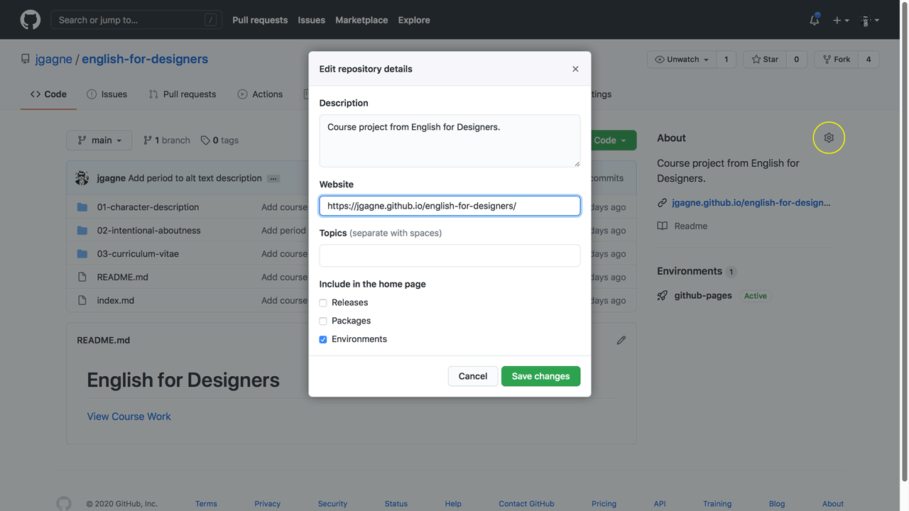

`Work-in-Progress`

# Curriculum Vitae

> As a law student, I went on a few job interviews. At one, the interviewer’s first comment was “It’s so unusual that I see a résumé without any typos.”
>
>—[Matthew Butterick](https://practicaltypography.com), [résumés](https://practicaltypography.com/resumes.html)

> Content precedes design. Design in the absence of content is not design, it’s decoration.
>
>—[Jeffrey Zeldman](https://twitter.com/zeldman/status/804159148?lang=en)

## Brief

Write and design a curriculum vitae, résumé, in Markdown for content first, and as a downloadable PDF for design second.

1. Use Markdown to focus on content first only, while providing a link to a PDF version.
2. Use a PDF to focus on the look and feel with typography, color, and layout — design second.

## Wrap-Up

Present your work as a public website. Think of `github.com` as the behind-the-scenes version of your content (folders and files), and `github.io` as the public, home page, version of your content with a table of contents (navigation), links to pages (content), etc.).

1. [Enable GitHub Pages](https://docs.github.com/en/free-pro-team@latest/github/working-with-github-pages/configuring-a-publishing-source-for-your-github-pages-site#choosing-a-publishing-source) on your course repo
2. Update your repo’s About section with a description and website URL; add the link generated after GitHub Pages is enabled.
 - For example: [`https://jgagne.github.io/english-for-designers/`](https://jgagne.github.io/english-for-designers/)

<details>
<summary>About section screenshot</summary>



</details>

3. Create an `index.md` as a table of contents (or home page) for your public website `https://username.github.io/english-for-designers` that links to your various content.
- For example: [`https://github.com/jgagne/english-for-designers/blob/main/index.md`](https://github.com/jgagne/english-for-designers/blob/main/index.md)

**Note:** When linking to your content from `index.md`, omit the Markdown file extension (<del>`.md`</del>)

4. Update your `README.md` to describe the contents of your repo and link to your website.
 - For example: [`https://github.com/jgagne/english-for-designers/blob/main/README.md`](https://github.com/jgagne/english-for-designers/blob/main/README.md)

## Handoff

Share your repo URL in the `03-curriculum-vitae` project channel of your Slack workspace.

**Optional:** Share via email or Slack for feedback before posting to the project channel.

### GitHub Config

- Create a project folder (repo) with a Markdown file and a PDF file, with an *optional* `img` folder for an *optional* headshot image and/or a `pdf` folder for the PDF, if you want to be overly organized.
  - For example:
    - `03-curriculum-vitae`
      - `cv-2020-jgagne.md`
      - `cv-2020-jgagne.pdf`

**Note:**

It’s useful to add the year, YYYY, to the filename to keep yourself current.

Also as a reminder, use of a first name initial followed by last name (surname) combined with the best practice of all-lowercase and separate words with hyphens helps to keep the filename short, accessible, and readable.

### Markdown Files

- `cv-2020-jgagne.md`

```
[View CV (PDF)](cv-2020-jgagne.pdf)

# …

**Optional:** 

Use Markdown for headings, paragraphs, lists, quotes, images, etc., to add structural meaning to your content.

```

## CV/Résumés Examples

- [Amanda Pinsker](https://amandapinsker.com)
  - [PDF version](https://amandapinsker.com/pinsker-resume-2020.pdf)
- [Bethany Heck](https://heckhouse.com/about/)
  - [PDF version](https://www.dropbox.com/s/r765mszd44pdgbq/BethanyHeckresume.pdf)
- [Erik Herrström](https://erikherrstrom.com/about.php)
- [Jason Zimbars](http://jasonzimdars.com/resume.html)
- [Nick Sherman](https://nicksherman.com)

## Readings

### CV/Résumés

- [résumés](https://practicaltypography.com/resumes.html)
- [How to design your own resume](https://uxdesign.cc/how-to-design-your-resumes-3b86ff7d9f76)
- [Why Is a Resume Important?](https://www.indeed.com/career-advice/resumes-cover-letters/why-is-a-resume-important)
- [Résumé Tips](https://thegymnasium.com/jobs#resume-tips)

### Content First

- [Write First: The Craft of Content-first Design](https://medium.com/google-design/write-first-the-craft-of-content-first-design-d9460d567947)
- [Content-First Design](https://alistapart.com/blog/post/content-first-design/)

### Cover Letters

- [Forget the resume, kill on the cover letter](https://signalvnoise.com/posts/1748-forget-the-resume-kill-on-the-cover-letter)
- [Cover Letter Template with Tips and
Examples](https://www.indeed.com/career-advice/resumes-cover-letters/cover-letter-template)

### Interviewing

- [The newest Signal: Jason Zimdars, designer](https://signalvnoise.com/posts/1726-the-newest-signal-jason-zimdars-designer)
- [Interviewing Tips](https://thegymnasium.com/jobs#interviewing-tips)

### Soft Skills

- [5 soft skills every graphic designer needs for a successful career](https://dribbble.com/stories/2020/08/25/graphic-designer-soft-skills)

## Resources

### Markdown

- [Creating a digital CV in Markdown on GitHub](https://workwithcarolyn.com/blog/digital-cv-guide)
- [Markdown Guide: Basic Syntax](https://www.markdownguide.org/basic-syntax/)

### Punctuation

- [The Punctuation Guide](https://www.thepunctuationguide.com)

## Vocabulary

- **Soft skills**
  - Personal attributes that enable someone to interact effectively and harmoniously with other people. Storytelling is an essential soft skill that enhances a designer’s ability to better communicate and deliver more compelling design experiences.
- **En dash**
  - The en dash (–) is slightly wider punctuation mark than the hyphen (-) but narrower than the em dash (—). The en dash is used to represent a span or range of numbers, dates, or time.
- **Em dash**
  - Do not mistake the em dash (—) for the slightly narrower en dash (–) or the even narrower hyphen (-). The em dash is perhaps the most versatile punctuation mark. Depending on the context, the em dash can take the place of commas, parentheses, or colons⁠ — in each case to slightly different effect.
- **Oxford comma (serial comma)**
  - The final comma in a list of items is known as an Oxford comma or serial comma. Some writers omit the Oxford comma, but doing so can cause confusion. Empathy, listening, and critical thinking are soft skills that software won’t ever replace — oh, and good writing.
- **Home page (homepage)**
 - The first and main page or screen (home screen, homescreen, or start screen) of a digital experience within a website, app, or device. The home page of the first website can be viewed at [http://info.cern.ch/hypertext/WWW/TheProject.html](http://info.cern.ch/hypertext/WWW/TheProject.html)
